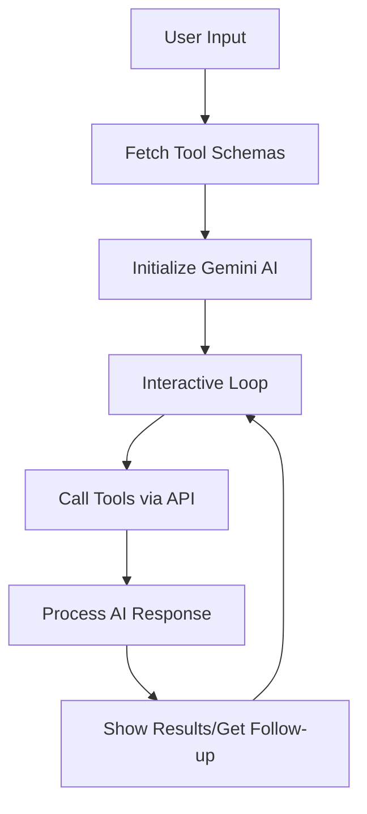
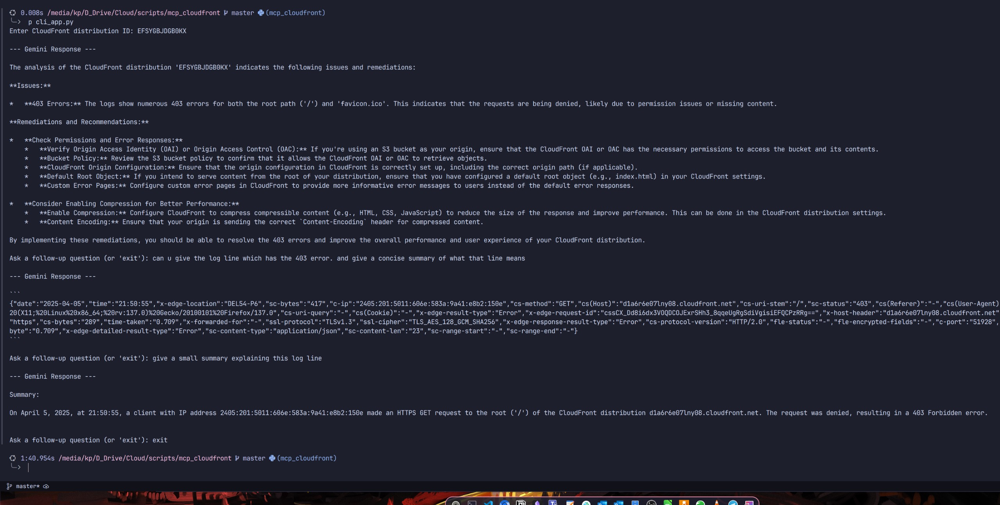

# ** Basic Gemini MCP client**

1. AWS Lambda Code (API Gateway Integration):
This is a custom MCP that provides three main tools:

```python
# Main tools provided:
a. get_distribution_info - Fetches CloudFront distribution details
b. fetch_logs - Retrieves CloudFront logs from CloudWatch
c. analyze_logs - Analyzes logs for issues and suggests remediations
```

The Lambda function has two main endpoints:
- `/list_tools` (GET): Returns available tools and their schemas
- `/call_tool` (POST): Executes the requested tool with given parameters

2. Client Code:



Key Components:
1. API Integration:
```python
async def call_tool(session, tool_name, parameters):
    # Makes HTTP POST requests to Lambda API
```

2. Gemini Integration:
```python
client = genai.Client(api_key=GEMINI_API_KEY)
```

3. Conversation Flow:
- Gets CloudFront distribution ID from user
- Uses Gemini AI to determine which tools to call
- Makes API calls to Lambda function
- Processes and displays results
- Handles follow-up questions





